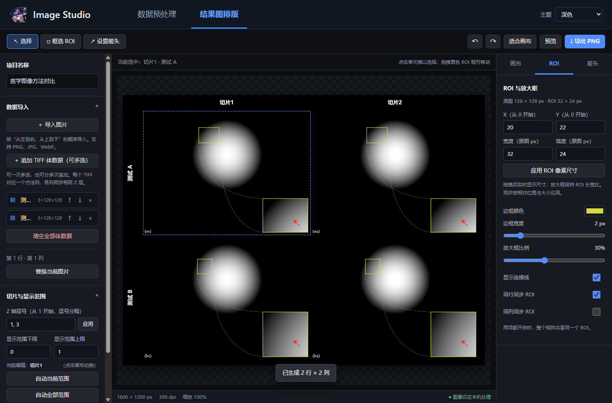

# Image Studio

用于实验图像预处理与 ROI 对比图制作的 Windows 桌面软件。支持 EVI 数据校正、TIFF 体数据浏览、精确 ROI 标注和 PNG 排版导出，所有图像均在本机处理。



## 功能

- **数据预处理**：删除首帧、裁剪无效边缘、坏点插值、空气平均及 postlog 校正。
- **结果图排版**：多图对比、切片选择、显示范围调整、ROI 局部放大、箭头与连接线、行列标签及 PNG 导出。
- **主题切换**：深色、浅色、跟随系统，自动记住上次选择。

通过顶部标签切换两个工作区，各自选择输入与输出。切换工作区会保留当前 ROI 排版；关闭软件前请导出需要保存的图片。

## 运行

需要 Windows 和 Microsoft Edge WebView2 Runtime。

构建完成后，打开 `dist/ImageStudio/ImageStudio.exe`。将软件复制到其他电脑时，请复制整个 `dist/ImageStudio` 文件夹，包括 `_internal`，无需在目标电脑安装 Python。

本仓库提供源码，构建方法见下文。

## 数据预处理

### 输入与操作

1. 选择物体 EVI 文件和空气 EVI 文件。
2. 选择坏点 mask，默认使用附带的 `maskplus.raw`，其中值为 `1` 的位置表示坏点。
3. 选择处理模式和输出目录，点击“开始处理”。

| 模式 | 物体处理 | 空气处理 |
| --- | --- | --- |
| 三维体层 | 保留有效帧，逐帧计算 postlog | 有效帧处理后平均为一张 |
| 单张平均 | 有效帧处理后平均为一张，再计算 postlog | 有效帧处理后平均为一张 |

### 处理流程

物体与空气均先删除第一帧，再裁掉每帧顶部和底部各两行，并按 mask 插值修复坏点。空气始终在插值后取平均。

校正结果按自然对数计算：

```text
postlog = -ln(物体 / 平均空气)
```

计算中使用 `1e-10` 进行数值保护。单张平均模式下，公式中的物体为插值后的平均图像。

### 输出

每次处理生成独立的结果目录：

| 文件 | 内容 |
| --- | --- |
| `object_corrected.tif` | 物体插值结果，按模式输出体数据或单张图像 |
| `air_mean_corrected.tif` | 插值后的平均空气图像 |
| `postlog.tif` | postlog 校正结果 |
| `report.json` | 处理参数与结果信息 |

默认输出 TIFF 图像；勾选“同时输出 RAW”后额外生成 RAW 文件。原始输入文件保持不变。

预览支持帧切换、显示范围调整、全图定位和局部缩放。图像按真实长宽比显示；预览操作不会改变数据。处理完成后，可选择查看物体插值结果、平均空气或 postlog。

## 结果图排版

1. **导入数据**：选择 PNG、JPG、WebP 图片，或导入一个或多个 TIFF 体数据文件。
2. **组织布局**：设置行列数、方法方向与行列标签；体数据可指定切片层号，并调整每层显示范围。
3. **编辑 ROI**：在画布框选或输入像素坐标与尺寸，设置局部放大框、边框、连接线及同行／同列同步。
4. **调整样式**：设置箭头、画布尺寸、背景色、文字、编号和单元格间距。
5. **导出图片**：预览排版后，点击“导出 PNG”并选择保存位置。

左侧设置按“数据导入、切片与显示范围、行列排列、行列标签”分组，可折叠。右侧通过“画布 / ROI / 箭头”页签切换参数；文字和间距设置位于“画布”页签。顶部提供选择、框选 ROI、设置箭头、撤销、重做和预览操作。

切片层号从 `1` 开始；ROI 的 X、Y 像素坐标从 `0` 开始。未导入数据时可点击“查看示例”了解布局。

TIFF 支持标准、未压缩、单通道的 8/16/32 位整数或 float32 数据，不支持压缩 TIFF 和 BigTIFF。

主题仅影响软件界面，不改变图像像素、画布背景设置或导出图片的配色。

## 开发与构建

安装 Python 3.12，在项目目录执行：

```powershell
py -3.12 -m venv .build_env
.\.build_env\Scripts\python.exe -m pip install -r requirements.txt
```

运行源码：

```powershell
.\.build_env\Scripts\python.exe desktop.py
```

构建 Windows 程序：

```powershell
.\build.ps1
```

构建结果位于 `dist/ImageStudio`。仓库包含默认 mask 和界面资源，不包含实验数据、处理输出、虚拟环境或打包产物。

### 测试

```powershell
.\.build_env\Scripts\python.exe -m unittest -v test_pipeline.py test_flat_field.py test_preprocess.py
.\.build_env\Scripts\python.exe desktop.py --self-test qa/smoke
```

集成检查会自动操作并关闭测试窗口，验证界面与合成 TIFF 数据。需要同时验证真实 EVI 预处理时，将环境变量 `IMAGE_STUDIO_QA_DATA` 指向包含 `纵1_TE.EVI` 和 `air_TE.EVI` 的本地目录。

## 主要文件

| 路径 | 用途 |
| --- | --- |
| `desktop.py` | 桌面窗口、本地文件交互与任务调度 |
| `pipeline.py` | 预处理流程与结果输出 |
| `preprocess.py`、`flat_field.py` | EVI 读取、坏点修复与平场校正 |
| `web/` | 工作区界面、主题与 ROI 排版工具 |
| `maskplus.raw` | 默认坏点 mask |
| `build.ps1` | Windows 打包脚本 |

## 依赖与资源

主要使用 NumPy、SciPy、tifffile、Pillow、pywebview 和 PyInstaller，版本见 `requirements.txt`。

界面工具图标使用 Bootstrap Icons（MIT），许可证见 [LICENSE](web/assets/icons/LICENSE)。应用人物图标为自定义图片资源。
